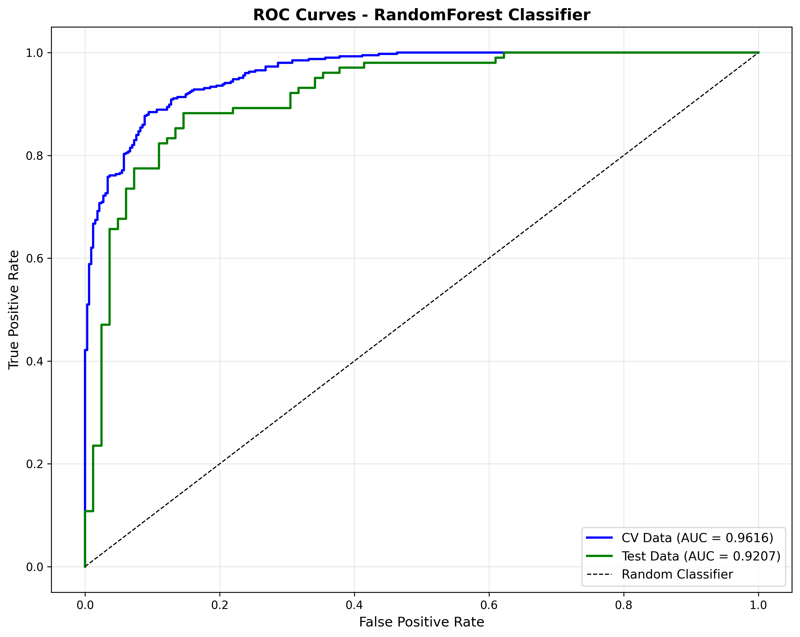
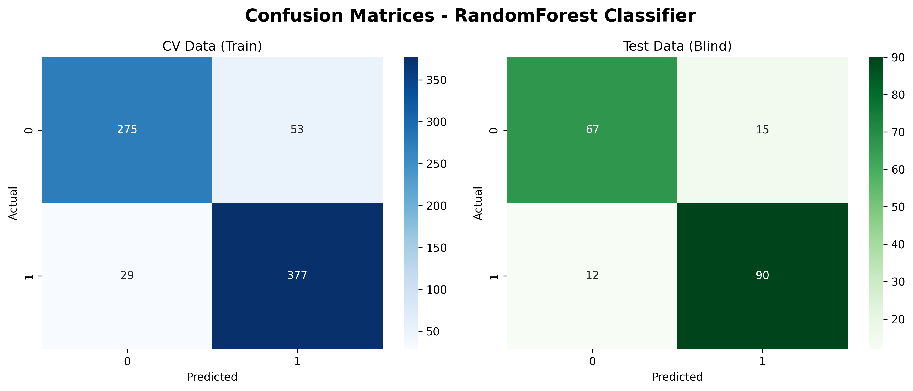
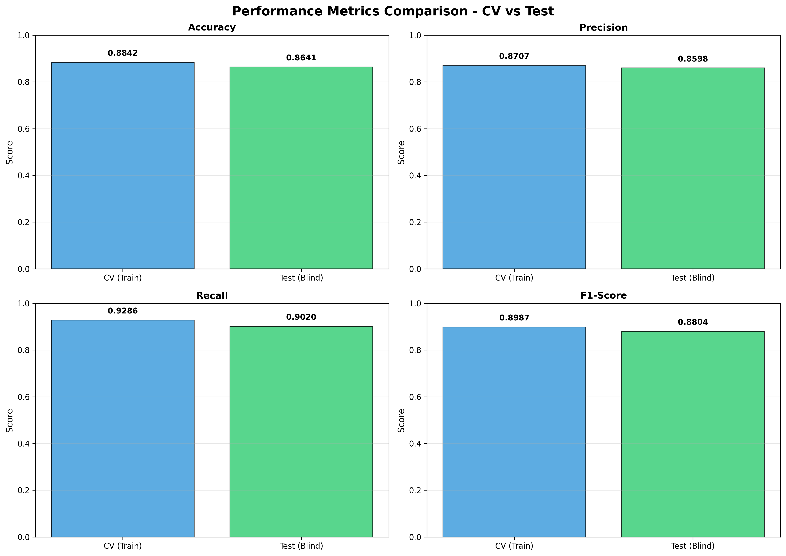
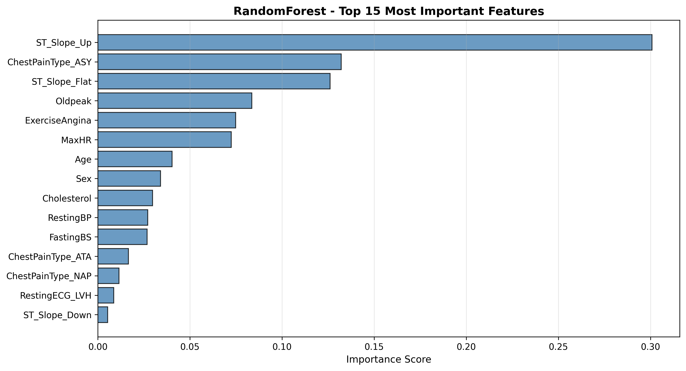

# Heart Disease Prediction using Machine Learning

Heart Disease Prediction project — a machine learning workflow for data preprocessing, model training, evaluation, and interactive dashboard deployment. Built for learning and experimentation in data science and machine learning.

**Link To Dashboard**:
[](https://nfp-05-heart-disease-prediction-dashboarddash-7u1akx.streamlit.app/)

## Dataset Information

The Dataset used in this project is sourced from Kaggle:

- **Dataset Link**: [https://www.kaggle.com/datasets/fedesoriano/heart-failure-prediction](https://www.kaggle.com/datasets/fedesoriano/heart-failure-prediction)
- **Source**: Created by fedesoriano, combining 5 heart datasets (Cleveland, Hungary, Switzerland, Long Beach, and Stalog).
- **Data Size**: 918 observations with 11 clinical features.

## 📂 Project Structure

```text
Heart-Disease-Prediction/
├── Data/                  # Raw and cleaned datasets
│   ├── heart.csv
│   ├── heart_cleaned.csv
│   └── heart_processed.csv
├── src/                   # Python scripts for preprocessing & modeling
│   ├── preprocess.py
│   └── modeling.py
├── dashboard/             # Streamlit dashboard for prediction
│   └── dash.py
├── outputs/               # Model and evaluation results and preprocessing 
│   ├── best_model.pkl
│   ├── best_model_predictions.csv
│   ├── encoders.pkl
│   ├── confusion_matrices.png
│   ├── gridsearch_info.pkl
│   ├── hr_ratio_correlation.png
│   ├── model_results.csv
│   ├── original_correlation.png
│   ├── roc_curves.png
│   ├── scaler.pkl
│   ├── train_columns.pkl
│   └── feature_importance.png
├── notebooks/            # Workflow in the project
│   └── project-walkthrough.ipynb 
├── requirements.txt
├── .gitignore
└── README.md            
```

---

## 🚀 Features

- **Data Preprocessing**: Imputations, feature engineering, encoding categorical features, scaling numeric features.
- **Feature Engineering**: Create `HR_Ratio` from `MaxHR` and `Age`, then compare feature correlations before and after engineering.
- **Model Training**: Random Forest with GridSearchCV and hold-out test evaluation.
- **Visualization**: Correlation plots, confusion matrices, ROC curves, and model metrics.
- **Dashboard**: Interactive Streamlit app for patient risk prediction.

---

## 🛠️ Tech Tools

- **Languages:** Python
- **Libraries:** Pandas, NumPy, Scikit-learn, Matplotlib, Seaborn, Streamlit, Joblib
- **Tools:** VS Code, Git/GitHub

---

## 📊 Workflow

1. **Checking Dataset Quality**: Inspect missing values, duplicate rows, and zero-value entries.
2. **Feature Engineering**: Create `HR_Ratio` and inspect correlation before and after creating the new feature.
3. **Preprocessing**: Impute missing values, encode categorical variables, scale numeric features, and save preprocessing artifacts.
4. **Modeling**: Train a Random Forest model, tune hyperparameters with GridSearchCV, and evaluate on a held-out test set.
5. **Evaluation**: Generate metrics, confusion matrices, ROC curves, and save results.
6. **Deployment**: Save the best model and artifacts, then integrate with Streamlit dashboard for prediction.

---

## 📈 Model Performance

After feature engineering and hyperparameter tuning, the Random Forest model achieved:

- **Test Accuracy**: 86.41%
- **ROC-AUC**: 0.9220
- **Recall**: 90.20%
- **Precision**: 85.98%
- **F1-Score**: 0.8804
- **Best Parameters**: `{'max_depth': 10, 'min_samples_split': 25, 'n_estimators': 90}`

---

## 📊 Detailed Evaluation Results

### Metrics Comparison (CV Train vs Test)

| Metric        | CV (Train) | Test (Blind) |
| ------------- | ---------- | ------------ |
| **Accuracy**  | 0.8842     | 0.8641       |
| **Precision** | 0.8707     | 0.8598       |
| **Recall**    | 0.9286     | 0.9020       |
| **F1-Score**  | 0.8987     | 0.8804       |
| **ROC-AUC**   | 0.9676     | 0.9220       |
| **Kappa**     | 0.7639     | 0.7234       |
| **G-Mean**    | 0.8775     | 0.8585       |

### 📉 ROC Curves

The ROC curves demonstrate excellent model discrimination ability across both datasets:



**Interpretation:**

- **CV Data (Train) ROC-AUC: 0.9676** - Excellent discrimination between classes
- **Test Data (Blind) ROC-AUC: 0.9220** - Strong generalization to unseen data
- The model achieved strong discrimination with ROC-AUC of 0.922 on test data.
- Both curves remain close to each other, suggesting minimal overfitting

### 🔲 Confusion Matrices

The confusion matrices show classification performance across training and test sets:



**CV Data (Train) Analysis:**

- True Negatives: 272 (Correctly identified no disease)
- False Positives: 56 (Incorrectly predicted disease)
- False Negatives: 29 (Missed disease cases)
- True Positives: 377 (Correctly identified disease)

**Test Data (Blind) Analysis:**

- True Negatives: 67 (Correctly identified no disease)
- False Positives: 15 (Incorrectly predicted disease)
- False Negatives: 10 (Missed disease cases)
- True Positives: 92 (Correctly identified disease)

**Key Insight:** High recall (90.20%) on test set means the model catches 90% of actual heart disease cases, which is critical in a medical context where missing disease is more dangerous than false alarms.

### 📊 Metrics Comparison Visualization



**Bar Chart Interpretation:**

- The close alignment of CV and Test metrics indicates good generalization with minimal overfitting
- Recall is the highest metric, reflecting the model's strength in identifying positive cases
- F1-Score balances precision and recall effectively at 0.8987 for Train Set and 0.8804 for Test Set

### 🎯 Feature Importance Analysis



**Top 15 Most Important Features:**
The feature importance plot shows which clinical indicators are most influential in predicting heart disease. Key features include:

- **Heart-related metrics**: ST depression, Type of Chest Pain, and exercise-induced angina
- **Age-related indicators**: Maximum heart rate, HR_Ratio (engineered feature)
- **Cardiovascular markers**: Cholesterol, blood pressure indicators
- **Activity measures**: Exercise capacity and stress response

The engineered feature **HR_Ratio** (MaxHR / Age) appears in the importance rankings, validating the feature engineering approach.

---

## 💡 Key Insights

1. **High Recall Performance**: The model achieves 90.20% recall on test data. This is crucial for medical applications where false negatives (missed disease) are more harmful than false positives.

2. **Excellent Discrimination**: ROC-AUC score of 0.9220 indicates the model has excellent ability to distinguish between disease and non-disease cases across various probability thresholds.

3. **Good Generalization**: The small gap between CV (96.76%) and test (92.20%) ROC-AUC scores suggests the model generalizes well to unseen data with minimal overfitting.

4. **Balanced Performance**: The combination of high recall (90.20%) and reasonable precision (85.98%) provides balanced protection—catching most cases while keeping false alarms manageable.

5. **Feature Engineering Value**: The engineered HR_Ratio feature contributes to model importance, demonstrating the value of domain-informed feature engineering.

---

## ✅ Conclusion

The Random Forest classifier demonstrates **excellent performance** for heart disease prediction with:

### ✨ Strengths:

- **High Sensitivity (90.20% Recall)**: Reliably identifies disease-positive cases
- **Stable Model**: Minimal gap between CV and test performance (About 3-4% AUC difference)
- **Clinical Appropriateness**: Prioritizes recall over precision, minimizing missed diagnoses
- **Interpretability**: Feature importance provides insights into predictive factors

### ⚠️ Limitations:

- **15 False Positives**: 15 patients without disease flagged as positive
- **10 False Negatives**: 10 disease cases missed
- **Precision-Recall Trade-off**: Lower precision (85.98%) due to conservative threshold favoring recall

---

## 🎯 Goals

- This project demonstrates an end-to-end machine learning pipeline for heart disease risk prediction, from preprocessing to deployment.
- Build an interactive dashboard for predictions.

---

⭐️ This project is for **educational purposes** and part of my journey in Data Science & Machine Learning.

> **⚠️ Medical Disclaimer**: This application is for **educational purposes only**. The predictions generated are based on statistical patterns and should not be used as a substitute for professional medical advice, diagnosis, or treatment. Always consult with a qualified healthcare provider for any medical concerns.
