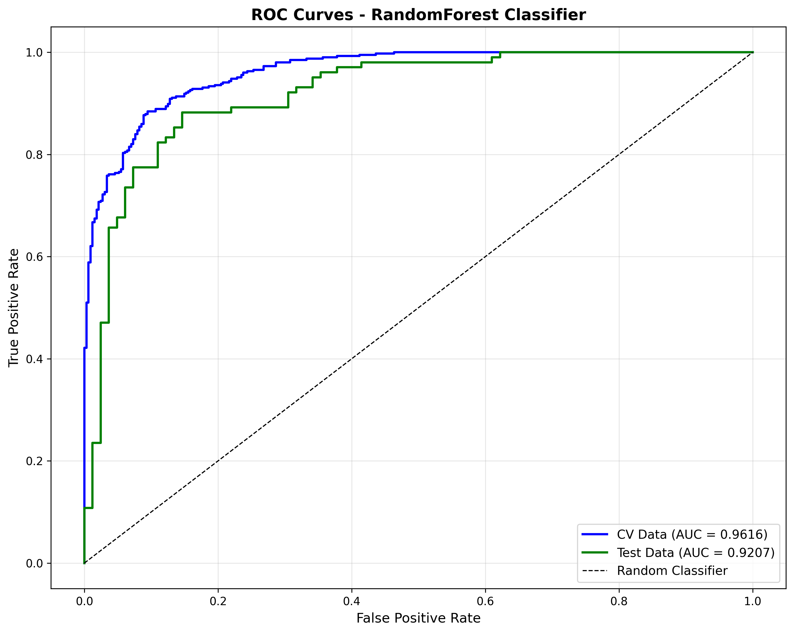
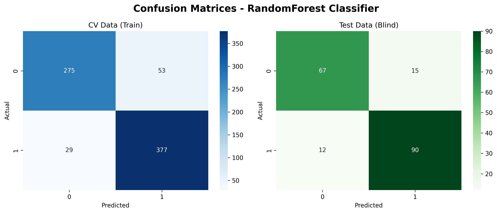
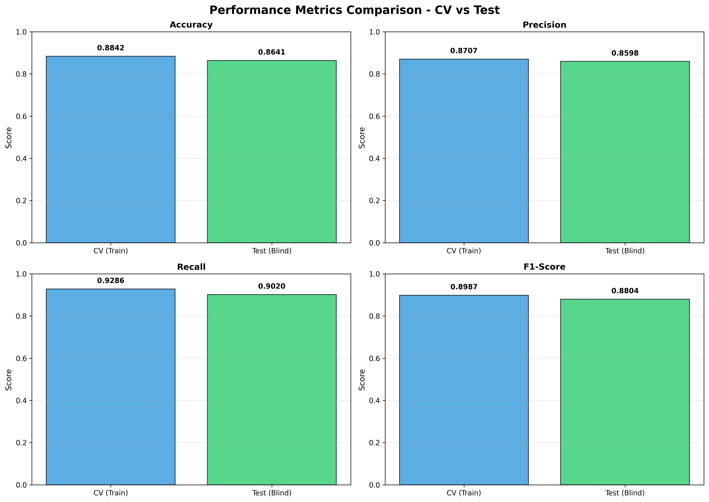

# Heart Disease Prediction using Machine Learning

Heart Disease Prediction project — a machine learning workflow for data preprocessing, model training, evaluation, and interactive dashboard deployment. Built for learning and experimentation in data science and machine learning.

**Link To Dashboard**:
[](https://nfp-05-heart-disease-prediction-dashboarddash-7u1akx.streamlit.app/)

## Dataset Information

The Dataset used in this project is sourced from Kaggle:

- **Dataset Link**: [https://www.kaggle.com/datasets/fedesoriano/heart-failure-prediction](https://www.kaggle.com/datasets/fedesoriano/heart-failure-prediction)
- **Source**: Created by fedesoriano, combining 5 heart datasets (Cleveland, Hungary, Switzerland, Long Beach, and Stalog).
- **Data Size**: 918 observations with 12 clinical features.

## 📂 Project Structure

```text
Heart-Disease-Prediction/
├── Data/                  # Raw and cleaned datasets
│   ├── heart.csv
│   ├── heart_cleaned.csv
│   └── heart_processed.csv
├── src/                   # Python scripts for preprocessing & modeling
│   ├── preprocess.py
│   └── modeling.py
├── dashboard/             # Streamlit dashboard for prediction
│   └── dash.py
├── outputs/               # Model and evaluation artifacts
│   ├── best_model.pkl
│   ├── best_logistic_regression.pkl
│   ├── best_model_predictions.csv
│   ├── confusion_matrices.png
│   ├── encoders.pkl
│   ├── feature_comparison.png
│   ├── hr_ratio_correlation.png
│   ├── metrics_comparison.png
│   ├── model_eval_data.pkl
│   ├── model_results.csv
│   ├── original_correlation.png
│   ├── roc_curves.png
│   ├── scaler.pkl
│   ├── train_columns.pkl
│   └── gridsearch_info.pkl
├── notebooks/            # Workflow in the project
│   └── project-walkthrough.ipynb
├── requirements.txt
├── .gitignore
└── README.md
```

---

## Features

- **Data Preprocessing**: Imputation of missing values, feature engineering, categorical encoding, and feature scaling.
- **Feature Engineering**: Create `HR_Ratio` from `MaxHR` and `Age`, then compare feature correlations before and after engineering.
- **Model Training**: Compare Random Forest and Logistic Regression using GridSearchCV and a held-out test set.
- **Evaluation**: Measure accuracy, precision, recall, specificity, F1-score, ROC-AUC, kappa, and G-mean.
- **Visualization**: Generate confusion matrices, ROC curves, metric comparison plots, and feature/coefficients comparison charts.
- **Dashboard**: Interactive Streamlit app for patient risk prediction.

---

## 🛠️ Tech Tools

- **Languages:** Python
- **Libraries:** Pandas, NumPy, Scikit-learn, Matplotlib, Seaborn, Streamlit, Joblib
- **Tools:** VS Code, Git/GitHub

---

## Workflow

1. **Checking Dataset Quality**: Inspect missing values, duplicate rows, and zero-value entries.
2. **Feature Engineering**: Create `HR_Ratio` and inspect correlation before and after creating the new feature.
3. **Preprocessing**: Impute missing values, encode categorical variables, scale numeric features, and save preprocessing artifacts.
4. **Modeling**: Train a Random Forest and Logistic Regression model, tune hyperparameters with GridSearchCV, and evaluate on a held-out test set.
5. **Evaluation**: Generate metrics, confusion matrices, ROC curves, and save results.
6. **Deployment**: Save the best model and artifacts, then integrate with Streamlit dashboard for prediction.

---

## Model Performance

The modeling script now compares two classifiers:

- **Random Forest**
- **Logistic Regression**

Both models are tuned with GridSearchCV and evaluated on a held-out test set. The script reports and saves metrics such as accuracy, precision, recall, specificity, F1-score, ROC-AUC, kappa, and G-mean.

The main evaluation artifacts are stored in the outputs folder:

- [outputs/model_results.csv](outputs/model_results.csv) for the summarized metrics
- [outputs/best_model_predictions.csv](outputs/best_model_predictions.csv) for prediction results
- [outputs/best_model.pkl](outputs/best_model.pkl) and [outputs/best_logistic_regression.pkl](outputs/best_logistic_regression.pkl) for the trained models

---

## 📊 Detailed Evaluation Results

### Metrics Comparison

The following tables show the main evaluation metrics for both models on the CV and test sets.

#### Random Forest

| Dataset      | Accuracy | Precision | Recall | Specificity | F1-Score | ROC-AUC | G-Mean |
| ------------ | -------- | --------- | ------ | ----------- | -------- | ------- | ------ |
| CV (Train)   | 0.8851   | 0.8707    | 0.9286 | 0.8293      | 0.8987   | 0.9676  | 0.8775 |
| Test (Blind) | 0.8641   | 0.8598    | 0.9020 | 0.8171      | 0.8804   | 0.9220  | 0.8585 |

#### Logistic Regression

| Dataset      | Accuracy | Precision | Recall | Specificity | F1-Score | ROC-AUC | G-Mean |
| ------------ | -------- | --------- | ------ | ----------- | -------- | ------- | ------ |
| CV (Train)   | 0.8501   | 0.8491    | 0.8607 | 0.8049      | 0.8548   | 0.9255  | 0.8448 |
| Test (Blind) | 0.8913   | 0.8942    | 0.9118 | 0.8659      | 0.9029   | 0.9280  | 0.8885 |

### 📉 ROC Curves



### 🔲 Confusion Matrices



### 📊 Metrics Comparison Visualization



### 🎯 Feature Interpretation


This plot shows:

- Random Forest feature importance values
- Logistic Regression coefficient magnitudes

These visuals help interpret which clinical variables contribute most to the predictions.

---

## 💡 Key Insights

1. **Strong Performance of Logistic Regression**: The Logistic Regression model delivers the highest ROC-AUC on test data (0.9280), outperforming Random Forest (0.9220) in discrimination ability.

2. **Very High Recall**: Logistic Regression achieves 91.18% recall on the test set, which is important for reducing missed heart disease cases.

3. **Good Specificity**: Logistic Regression also scores 86.59% specificity on the test set, showing a balanced trade-off between catching disease and limiting false alarms.

4. **Competitive Random Forest**: Random Forest remains strong with 86.41% accuracy and 90.20% recall on the test set, making it a solid comparator.

5. **Feature Engineering Value**: The engineered HR_Ratio feature continues to add predictive power and is visible in both model interpretation plots.

---

## Conclusion

The Logistic Regression classifier demonstrates **strong and reliable performance** for heart disease prediction with:

### Strengths:

- **Good Balance of Metrics**: Strong performance across accuracy, recall, specificity, and ROC-AUC
- **Interpretability**: Coefficients are easier to interpret than tree-based models
- **Stable Generalization**: Good performance on the held-out test set
- **Practical Use**: Suitable as a baseline and competitive model for this classification task

### Limitations:

- Some false positives and false negatives are still present, as is common in medical prediction tasks
- The model may still benefit from further tuning, threshold adjustment, or comparison with additional algorithms

---

## Goals

- This project demonstrates an end-to-end machine learning pipeline for heart disease risk prediction, from preprocessing to deployment.
- Build an interactive dashboard for predictions.

---

This project is for **educational purposes** and part of my journey in Data Science & Machine Learning.

> **⚠️ Medical Disclaimer**: This application is for **educational purposes only**. The predictions generated are based on statistical patterns and should not be used as a substitute for professional medical advice, diagnosis, or treatment. Always consult with a qualified healthcare provider for any medical concerns.
