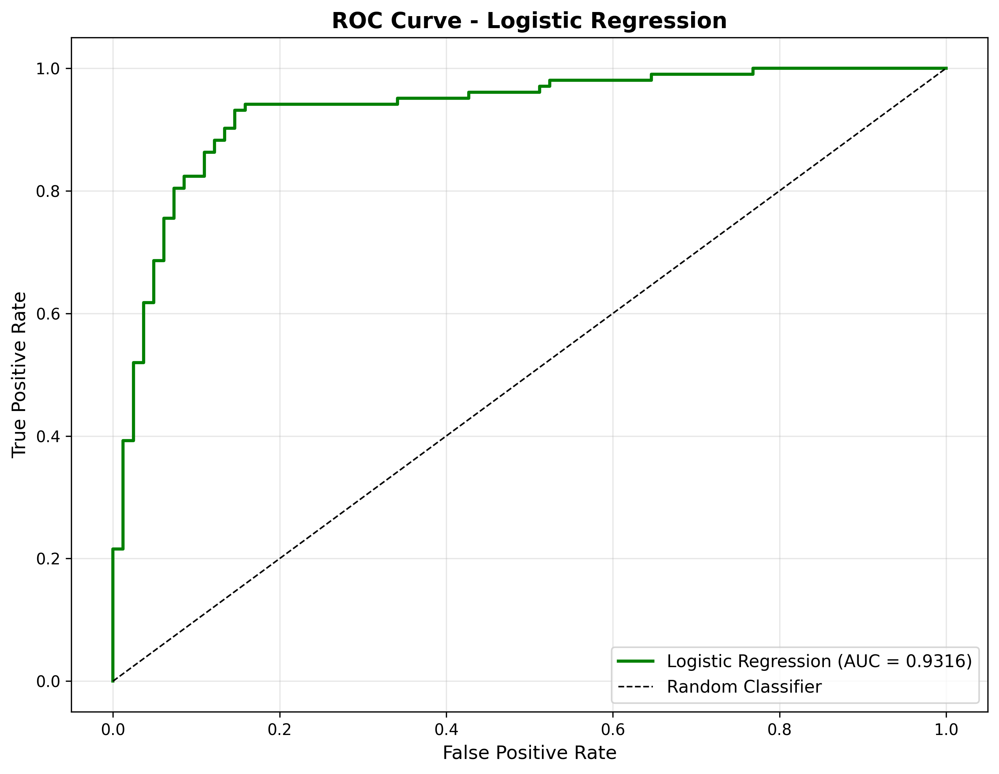
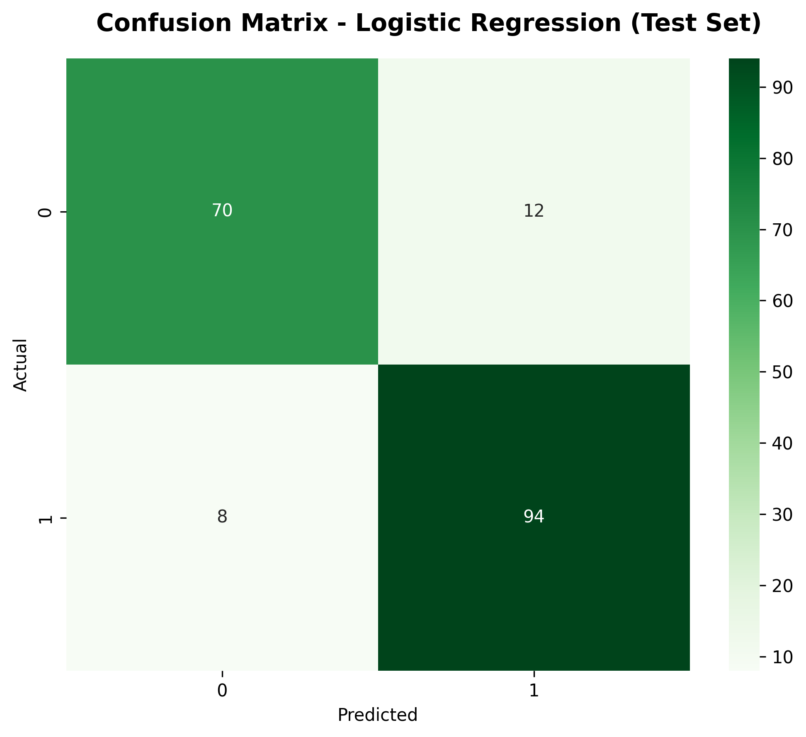
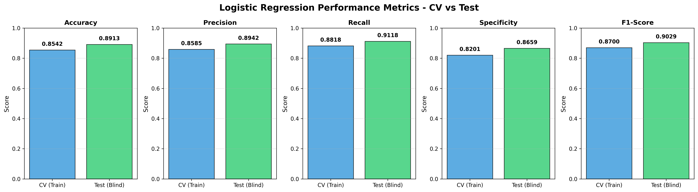
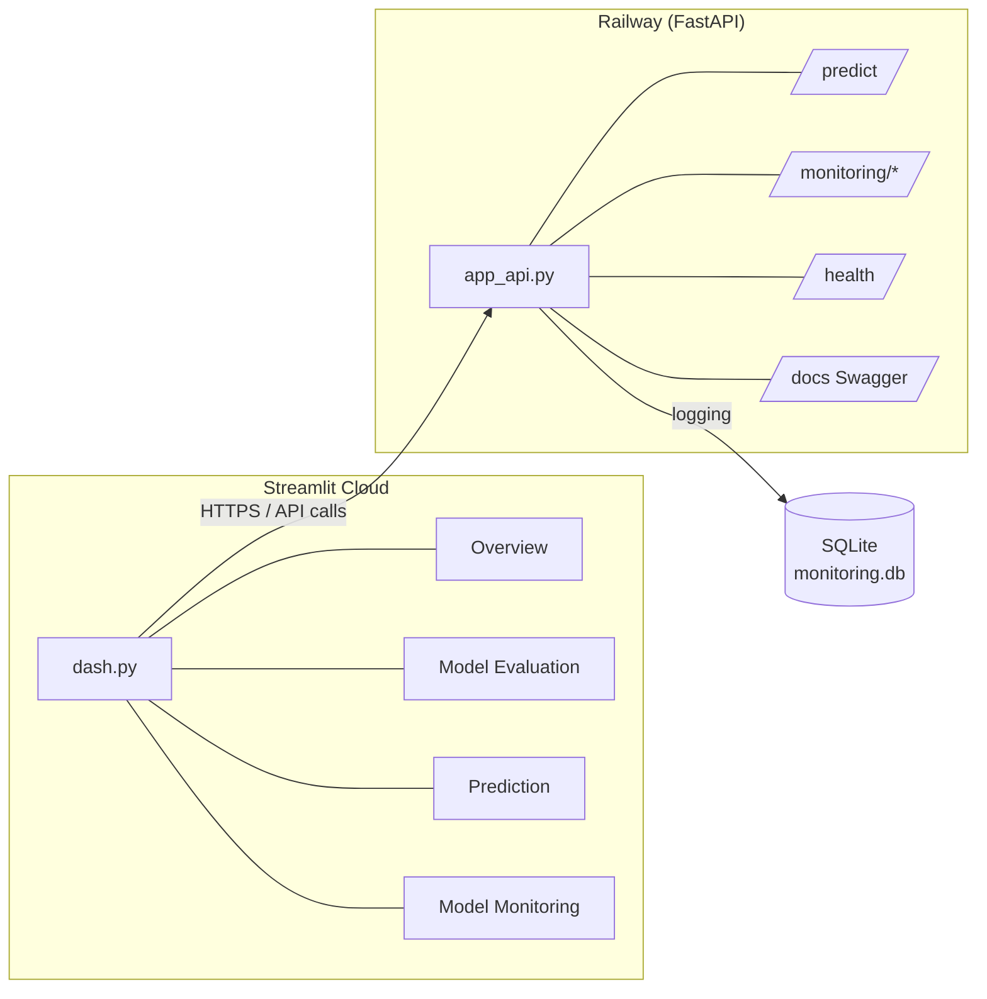

# Heart Disease Prediction using Machine Learning

Heart Disease Prediction project, a machine learning workflow for data preprocessing, model training, evaluation, and interactive dashboard deployment. Built for learning and experimentation in data science and machine learning.

## Demonstration

| Platform                | Link                                                                                                                                                            | Status                                         | Use Case |
| ----------------------- | --------------------------------------------------------------------------------------------------------------------------------------------------------------- | ---------------------------------------------- | -------- |
| **Streamlit Dashboard** | [](https://nfp-05-heart-disease-prediction-dashboarddash-7u1akx.streamlit.app/) | **Primary demo** > UI interaktif, selalu hidup |
| **FastAPI**             | [](https://heart-disease-prediction-production-9c74.up.railway.app/docs)                | **Primary API** > Inference + monitoring       |

## Dataset Information

The Dataset used in this project is sourced from Kaggle:

- **Dataset Link**: [https://www.kaggle.com/datasets/fedesoriano/heart-failure-prediction](https://www.kaggle.com/datasets/fedesoriano/heart-failure-prediction)
- **Source**: Created by fedesoriano, combining 5 heart datasets (Cleveland, Hungary, Switzerland, Long Beach, and Stalog).
- **Data Size**: 918 observations with 12 clinical features.

## Project Structure

```text
Heart-Disease-Prediction/
├── .streamlit/                         # Streamlit theme configuration
│   └── config.toml
│
├── Data/                               # Raw and cleaned datasets
│   ├── heart.csv                       ├── Raw dataset (918 x 12)
│   └── heart_cleaned.csv               └── Preprocessed dataset
│
├── src/                                # FastAPI Backend
│   └── app_api.py                      └── API: /predict, health, /monitoring
│
├── dashboard/                          # Streamlit dashboard for prediction
│   └── dash.py                         └── 4 Pages: Overview, Evaluation, Prediction, and Monitoring
│
├── notebooks/                          # Jupyter notebooks (EDA → Preprocess → Modeling)
│   ├── EDA_Heart_Disease.ipynb
│   ├── Preprocess_Heart_DIsease.ipynb
│   └── Modeling_Heart_Disease.ipynb
│
├── outputs/                            # Model & evaluation outputs
├── requirements.txt                    # Python Dependencies
├── .gitignore
└── README.md
```

---

## Tech Tools

- **Libraries:** Pandas, NumPy, Scikit-learn, Matplotlib, Seaborn, Plotly, Statsmodels, Joblib, SciPy, Uvicorn, FastAPI, Requests
- **Backend:** **FastAPI**, **SQLite**
- **Frontend:** **Streamlit**
- **Deployment:** **Streamlit Cloud**, **Railway**
- **Tools:** VS Code, Git/GitHub

---

## Workflow

1. **Checking Dataset Quality**: Inspect missing values, duplicate rows, and zero-value entries.
2. **Preprocessing**: Impute missing values, encode categorical variables, scale numeric features (including `MaxHR`), and save preprocessing artifacts.
3. **Modeling**: Train a Logistic Regression model, tune hyperparameters with GridSearchCV, and evaluate on a held-out test set.
4. **Further Experiment**: Including: _Threshold Optimization_, Find optimal probability cutoff on CV set. _Improved LR Experiment_, Expanded hyperparameter grif with L1/L2, class_weight.
5. **Model Comparison**: Baseline vs Improved LR across CV/Test with optimal thresholds.
6. **Evaluation**: Generate metrics, confusion matrices, ROC curves, and save results.
7. **Monitoring Setup**: SQLite logging + Streamlit monitoring page

---

## Model Performance

The modeling notebook trains and compares **two Logistic Regression variants**:

- **Baseline LR**: GridSearchCV (C, solver), 18 features, threshold 0.5
- **Improved LR**: Expanded grid (C, penalty, solver, class_weight), L1 feature selection → 9 features

**Final model selected: Logistic Regression Baseline** (18 features, threshold 0.5)  
_Reason: Better threshold-independent metrics; Improved LR advantage only appears after threshold tuning._

---

## Detailed Evaluation Results

### Metrics Comparison Table

| Model                       | Dataset      | Accuracy | Precision | Recall | Specificity | F1-Score | G-Mean | ROC-AUC | MCC    | PR-AUC |
| --------------------------- | ------------ | -------- | --------- | ------ | ----------- | -------- | ------ | ------- | ------ | ------ |
| LR Baseline                 | CV (Train)   | 0.8597   | 0.8651    | 0.8842 | 0.8293      | 0.8745   | 0.8563 | 0.9283  | 0.7156 | 0.9334 |
| LR Baseline                 | Test (Blind) | 0.8913   | 0.8868    | 0.9216 | 0.8537      | 0.9038   | 0.8870 | 0.9316  | 0.7797 | 0.9412 |
| LR Baseline (Opt Threshold) | Test (Blind) | 0.8587   | 0.9222    | 0.8137 | 0.9146      | 0.8646   | 0.8627 | 0.9316  | 0.7242 | 0.9412 |
| LR Improved                 | CV (Train)   | 0.8569   | 0.8644    | 0.8793 | 0.8293      | 0.8718   | 0.8539 | 0.9286  | 0.7102 | 0.9338 |
| LR Improved                 | Test (Blind) | 0.8913   | 0.8868    | 0.9216 | 0.8537      | 0.9038   | 0.8870 | 0.9322  | 0.7797 | 0.9428 |
| LR Improved (Opt Threshold) | Test (Blind) | 0.8587   | 0.9222    | 0.8137 | 0.9146      | 0.8646   | 0.8627 | 0.9322  | 0.7242 | 0.9428 |

The table above compares **three variants** of Logistic Regression:

1. **LR Baseline**. The standard model trained on all **18 features** (age, blood pressure, cholesterol, heart rate, plus one-hot encoded categorical features). It predicts using the default **0.5 probability threshold**: a patient is flagged as at-risk only when the predicted probability exceeds 50%.

2. **LR Improved**. Uses **L1 (Lasso) regularization** during hyperparameter search. Lasso shrinks irrelevant feature coefficients to zero, effectively selecting only the **9 most important features**. This tests whether a simpler model can match the baseline's performance.

3. **LR (Opt Threshold)**. The same models, but the prediction cutoff is **tuned instead of fixed at 0.5**. On the CV set, the threshold is chosen to **maximize Recall while keeping Precision ≥ 0.88** (the precision level the model already achieves at the default cutoff). The goal is screening-oriented: catch as many true positives as possible without increasing the false-alarm rate beyond what the model already produces.

### ROC Curve



### Confusion Matrix



### Metrics Visualization



### Feature Interpretation: Odds Ratio Analysis

Each feature's effect on the odds of heart disease, holding other variables constant
(statsmodels logistic regression on the CV set). Reference categories:
`ChestPainType = ASY`, `RestingECG = Normal`, `ST_Slope = Up`.
Continuous features are standardized > odds ratios reflect a **1-standard-deviation** change.

Sorted by odds ratio (descending). **Bold** odds ratios are statistically significant (p < 0.05).

| Feature           | Coefficient | Odds Ratio | 95% CI       | p-value |
| ----------------- | ----------- | ---------- | ------------ | ------- |
| ST_Slope_Flat     | +2.451      | **11.60**  | 6.81 – 19.76 | <0.001  |
| ST_Slope_Down     | +1.571      | **4.81**   | 1.62 – 14.27 | 0.005   |
| Sex (M)           | +1.434      | **4.20**   | 2.28 – 7.71  | <0.001  |
| FastingBS (>120)  | +1.307      | **3.69**   | 2.03 – 6.72  | <0.001  |
| ExerciseAngina    | +0.837      | **2.31**   | 1.37 – 3.90  | 0.002   |
| Oldpeak           | +0.236      | **1.27**   | 0.97 – 1.66  | 0.087   |
| RestingECG_LVH    | +0.226      | **1.25**   | 0.69 – 2.28  | 0.458   |
| Age               | +0.069      | **1.07**   | 0.82 – 1.40  | 0.618   |
| Cholesterol       | +0.041      | **1.04**   | 0.82 – 1.32  | 0.732   |
| RestingECG_ST     | +0.015      | **1.02**   | 0.54 – 1.91  | 0.963   |
| RestingBP         | −0.022      | **0.98**   | 0.77 – 1.24  | 0.856   |
| MaxHR             | −0.279      | **0.76**   | 0.58 – 0.99  | 0.044   |
| ChestPainType_TA  | −1.482      | **0.23**   | 0.09 – 0.55  | 0.001   |
| ChestPainType_ATA | −1.772      | **0.17**   | 0.08 – 0.34  | <0.001  |
| ChestPainType_NAP | −1.822      | **0.16**   | 0.09 – 0.29  | <0.001  |

**Reading the table:**

- **OR > 1 = risk factor** (ST_Slope_Flat raises odds **11.6×** vs. up-sloping; Male **4.2×**; FastingBS > 120 **3.7×**).
- **OR < 1 = protective** (chest pain types ATA/NAP/TA lower odds vs. **ASY** — asymptomatic pain is the highest-risk category; higher MaxHR lowers odds).
- The strongest single signal is `ST_Slope_Flat`, consistent with the coefficient plot below.

---

## Key Insights

1. **Threshold Optimization (Recall-First Screening)**: Optimal threshold is tuned on the CV set to **maximize Recall while keeping Precision ≥ 0.88** (the precision level the model already achieves at the default cutoff). This catches more true positives with the same false-alarm rate, a larger practical gain than expanding the grid search.

2. **Improved LR Advantage is Threshold-Driven**: Improved LR (9 features via L1) only beats Baseline _after_ threshold tuning under the same criterion (Max Recall, Precision ≥ 0.88); on threshold-independent metrics (ROC-AUC, PR-AUC), Baseline is slightly better.

3. **Baseline Selected for Production**: 18 features, consistent with odds ratio analysis, already deployed in dashboard, simpler to maintain.

4. **Monitoring Ready**: SQLite logging + Streamlit monitoring page enables production observability. _(Note: data resets on redeploy on Railway free tier)_

---

## Deployment Architecture


```mermaid
flowchart LR
    subgraph Frontend["Streamlit Cloud"]
        A[dash.py]
        A --- P1[Overview]
        A --- P2[Model Evaluation]
        A --- P3[Prediction]
        A --- P4[Model Monitoring]
    end

    subgraph Backend["Railway (FastAPI)"]
        B[app_api.py]
        B --- E1[/predict/]
        B --- E2[/monitoring/*/]
        B --- E3[/health/]
        B --- E4[/docs Swagger/]
    end

    A -- "HTTPS / API calls" --> B
    B -- "logging" --> DB[(SQLite\nmonitoring.db)]
```

---

## Conclusion

The Logistic Regression classifier demonstrates **strong and reliable performance** for heart disease prediction with:

### Strengths:

- **Good Balance of Metrics**: Strong performance across accuracy, recall, specificity, and ROC-AUC
- **Interpretability**: Coefficients are easier to interpret than tree-based models
- **Stable Generalization**: Good performance on the held-out test set
- **Practical Use**: Suitable as a baseline and competitive model for this classification task

### Limitations:

- Some false positives and false negatives are still present, as is common in medical prediction tasks
- The model may still benefit from further tuning, threshold adjustment, or comparison with additional algorithms

---

## Goals

- This project demonstrates an end-to-end machine learning pipeline for heart disease risk prediction, from preprocessing to deployment.
- Build an interactive dashboard for predictions.

---

This project is for **educational purposes** and part of my journey in Data Science & Machine Learning.

> **Medical Disclaimer**: This application is for **educational purposes only**. The predictions generated are based on statistical patterns and should not be used as a substitute for professional medical advice, diagnosis, or treatment. Always consult with a qualified healthcare provider for any medical concerns.
